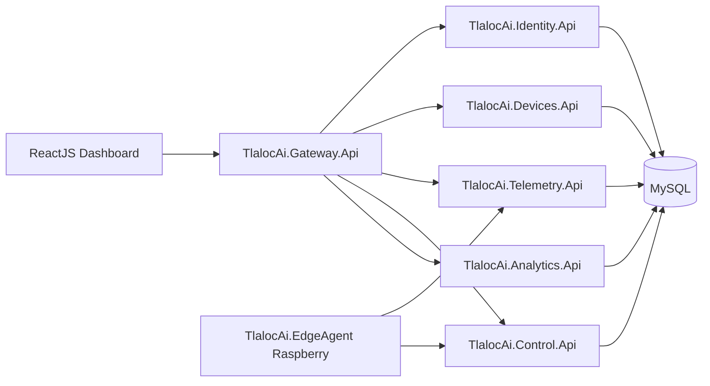

# TlalocAi.Platform

Backend de microservicios para un sistema de medicion de agua en un modelo a escala de una calle. La Raspberry Pi 2 ejecuta `TlalocAi.EdgeAgent`, lee sensores, controla bomba/electrovalvulas y se comunica con esta plataforma por HTTP.

## Arquitectura

La solucion usa .NET 10, ASP.NET Core Web API, Clean Architecture, EF Core, MySQL, Docker, Swagger, health checks, JWT para frontend y API Key para dispositivos.



Cada servicio mantiene `Domain`, `Application`, `Infrastructure` y `Api`. `Analytics` es read model sobre telemetria. En MySQL el MVP usa una base compartida (`tlalocai_databse`) con tablas prefijadas por servicio.

## Requisitos

- .NET SDK 10.
- Docker Desktop o Docker Engine con Compose.
- MySQL disponible en `localhost:3306` con la base `tlalocai_databse`.

## Ejecutar Localmente

```bash
cp .env.example .env
bash scripts/run-local.sh
```

El `docker compose` de este repo no crea otra base; usa la instancia MySQL que ya corre en tu host mediante `host.docker.internal`.

Puertos:

- Gateway: `http://localhost:5100`
- Identity: `http://localhost:5101`
- Devices: `http://localhost:5102`
- Telemetry: `http://localhost:5103`
- Control: `http://localhost:5104`
- Analytics: `http://localhost:5105`

Swagger esta habilitado solo en `Development`, por ejemplo `http://localhost:5101/swagger`.

`scripts/run-local.sh` construye las imagenes en secuencia para evitar que Docker mate el `publish` de .NET por memoria cuando se intentan compilar todos los microservicios al mismo tiempo.

## Base de Datos y Migraciones

Las migraciones se aplican sobre `localhost:3306/tlalocai_databse`. Para aplicarlas:

```bash
dotnet tool restore
bash scripts/update-database.sh
```

Para crear una nueva migracion:

```bash
bash scripts/add-migration.sh Devices AddDeviceField
```

Servicios con migraciones propias: `Identity`, `Devices`, `Telemetry`, `Control`. `Analytics` lee tablas existentes.

## Autenticacion

Frontend usa JWT:

```http
Authorization: Bearer {accessToken}
```

Raspberry usa API key:

```http
X-Device-Api-Key: {apiKey}
```

La API key se guarda hasheada. El valor claro solo se devuelve al crear dispositivo o rotar llave.

## Ejemplos

Crear usuario:

```bash
curl -X POST http://localhost:5101/api/auth/register \
  -H "Content-Type: application/json" \
  -d '{"fullName":"Admin","email":"admin@tlaloc.ai","password":"Password123!","role":"Admin"}'
```

Login:

```bash
curl -X POST http://localhost:5101/api/auth/login \
  -H "Content-Type: application/json" \
  -d '{"email":"admin@tlaloc.ai","password":"Password123!"}'
```

Crear Raspberry:

```bash
curl -X POST http://localhost:5102/api/devices \
  -H "Authorization: Bearer $TOKEN" \
  -H "Content-Type: application/json" \
  -d '{"id":"raspberry-calle-01","name":"Raspberry Calle 01","description":"Modelo de calle"}'
```

Agregar actuador:

```bash
curl -X POST http://localhost:5102/api/devices/raspberry-calle-01/actuators \
  -H "Authorization: Bearer $TOKEN" \
  -H "Content-Type: application/json" \
  -d '{"name":"pump","type":"Pump","gpioPin":27,"activeLow":false}'
```

Enviar telemetria:

```bash
curl -X POST http://localhost:5103/api/telemetry/batch \
  -H "X-Device-Api-Key: $DEVICE_API_KEY" \
  -H "Content-Type: application/json" \
  -d '{
    "deviceId":"raspberry-calle-01",
    "sentAtUtc":"2026-06-11T19:20:00Z",
    "measurements":[{
      "timestampUtc":"2026-06-11T19:19:55Z",
      "flowLpm":1.25,
      "totalLiters":3.45,
      "pumpOn":true,
      "levels":[{"name":"level_1","isActive":true}],
      "actuators":[{"name":"pump","isOn":true},{"name":"valve_1","isOn":false}]
    }]
  }'
```

Crear comando para bomba:

```bash
curl -X POST http://localhost:5104/api/commands \
  -H "Authorization: Bearer $TOKEN" \
  -H "Content-Type: application/json" \
  -d '{"deviceId":"raspberry-calle-01","type":"SetActuatorState","target":"pump","state":true}'
```

Consultar comandos pendientes desde Raspberry:

```bash
curl http://localhost:5104/api/devices/raspberry-calle-01/commands/pending \
  -H "X-Device-Api-Key: $DEVICE_API_KEY"
```

Al consultar pendientes, el servicio cambia `Pending` a `Sent`.

Confirmar comando:

```bash
curl -X POST http://localhost:5104/api/commands/{commandId}/ack \
  -H "X-Device-Api-Key: $DEVICE_API_KEY" \
  -H "Content-Type: application/json" \
  -d '{"deviceId":"raspberry-calle-01","success":true,"message":"Command executed","executedAtUtc":"2026-06-11T19:20:05Z"}'
```

Consultar estadisticas:

```bash
curl "http://localhost:5105/api/analytics/summary?deviceId=raspberry-calle-01" \
  -H "Authorization: Bearer $TOKEN"
```

## Variables de Entorno

Ver `.env.example`:

- `ConnectionStrings__DefaultConnection`
- `Jwt__Issuer`
- `Jwt__Audience`
- `Jwt__SigningKey`
- `DeviceAuth__ApiKeyHeaderName`
- `Cors__AllowedOrigins__0`
- `Cors__AllowedOrigins__1`

## Pruebas

```bash
dotnet build TlalocAi.Platform.sln
dotnet test TlalocAi.Platform.sln
```

## Despliegue

- APIs en Koyeb, Render, Fly.io, Railway o similar.
- MySQL administrado fuera del contenedor en produccion.
- Frontend en Vercel o Netlify.
- Si el hosting gratuito limita RAM, desplegar primero Gateway + servicios principales o compactar temporalmente en una sola API.
- No usar SQLite para produccion.

## Nota de Seguridad

`MySql.EntityFrameworkCore` depende de `MySql.Data`, que al momento de este scaffold reporta advertencias NuGet `NU1903` por `System.Security.Cryptography.Xml`. El proyecto compila y las pruebas pasan, pero conviene actualizar el proveedor MySQL cuando Oracle publique una version que resuelva esa dependencia transitiva.
